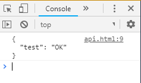

# APIコールテスト
[参考ページ](https://qiita.com/ykhirao/items/a41322085ab55837b88e#その他)を元に、gistを使ってapiコールをしてみた。

## 動機
元々はGoogleAPIが無料っぽいので使っていたら、残りクレジットとかいうこっわい文字を見るようになったので移行を検討。  
個人でしか使ってなければ、ましてや営利目的でも収益も上げていないものなのでお金を使いたくない！という強固な意思のもと、システムの移行先を探していたところ、Githubでprivateに対応したらしいので、なんかいい感じに出来ないかな？と考えた。  
ある程度秘匿性が保たれている環境でapiコールして情報が使えるならそれでもいいや、という程度の内容なので技術検証も含めてやってみる。

# 今回使用するデータ（Gist）
[callapi.json](https://gist.github.com/nomurayawork/17781f5131f7d98e4c4096338e052e8d)

    {
      "test": "OK"
    }

# Webサイトで取得したい場合
ユーザーがアクセスするたびに最新情報を取りたいのでトリガーをクライアントJavaScriptで実施する。  

    

# イメージ
HTML要素はないので、画面は真っ白です。  

# 使用例
そもそもGistはprivate設定にしていてもGistIDさえ分かれば中身が割れるし、GistIDは（やるかどうかは別として）ブルートフォースでいずれ特定できます。  
ヤバいデータは使わないようにしましょう。
